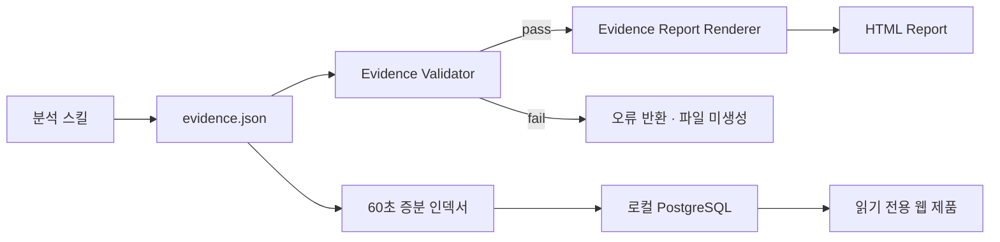

# 아키텍처

## 현재 목표

현재 수직 기능은 검증된 분석 artifact를 안전하게 HTML과 PostgreSQL 읽기 모델로 변환하고, 분석 이력·비교·운영 상태를 로컬 웹에서 제공하는 것이다.



## 계층

### 1. Orchestration

경로: `.agents/skills/run-stock-analysis-graph/`

종목 범위 설정, 독립 분석, 시나리오 구성, 반대 검토를 조정한다. 이 계층은 사용자·Codex와 프로젝트 코드를 연결하지만 핵심 검증 규칙을 소유하지 않는다.

### 2. Domain pipeline

경로: `scripts/pipeline/`

- `evidence_validator.py`: evidence schema와 안전 게이트
- `evidence_report.py`: 검증된 evidence를 HTML 표현으로 변환
- 기존 `weather_score.py`, `report_builder.py`: 실험 파이프라인 호환 기능

외부 네트워크나 전역 상태 없이 동작하는 순수 함수 중심으로 유지한다.

### 3. Application entry point

경로: `scripts/generate_evidence_report.py`

파일을 읽고, 검증하고, 성공 시 보고서를 원자적으로 기록한다. CLI 결과는 자동화가 소비할 수 있는 JSON으로 출력한다.

### 4. Artifacts

경로: `artifacts/runs/<run-id>/`

```text
evidence.json                원본 분석 증거
<ticker>-<yyyy-mm-dd>.html   파생 보고서
```

실행별 폴더는 불변 기록으로 취급한다. 새로운 분석은 기존 evidence를 덮어쓰지 않고 새로운 run ID를 만든다.

### 5. Read-only web application

경로: `src/my_stock_web/`

- `sync_service.py`: 시작 직후와 기본 60초 간격으로 결정적 인덱서를 실행
- `repository.py`: PostgreSQL 읽기 쿼리와 동일 종목 실행 조회
- `routes/`: 분석 이력, 종목 비교, 시스템 상태와 안전한 artifact 제공
- `templates/`: 한국어 리서치 노트 형식의 서버 렌더링 화면

웹 제품은 artifact를 수정하거나 분석·주문을 실행하지 않는다. PostgreSQL은 검색과 비교를 위한 재생성 가능한 파생 인덱스다.

## 의존성 방향

```text
skill/orchestrator → application CLI → domain pipeline → artifacts
                                                       ↓
                                    periodic indexer → PostgreSQL → web
```

도메인 파이프라인은 스킬 구현에 의존하지 않는다. 스킬에 포함된 validator 실행 파일은 프로젝트 validator를 호출하는 호환 어댑터로 유지한다.

## 안전 조건

- `schema_version`이 지원 버전이어야 한다.
- 출처와 주장의 ID 참조가 유효해야 한다.
- bull/base/bear 시나리오가 모두 있어야 한다.
- 반대 검토 결과가 `pass`여야 한다.
- `order_action`은 반드시 `none`이어야 한다.
- 동적 텍스트는 HTML escape 후 렌더링한다.
- 검증 실패 시 출력 파일을 만들지 않는다.

## 다음 단계

1. 자동 분석 스케줄러와 실행 상태
2. 관심 종목과 분석 주기 설정
3. 투자 판단 저널의 도메인 모델
4. 시나리오 조건의 사후 평가기
5. 필요할 때만 배포·알림 어댑터 추가
