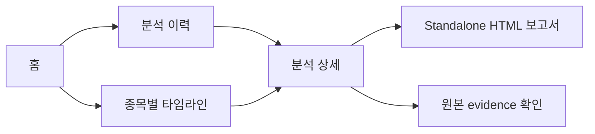
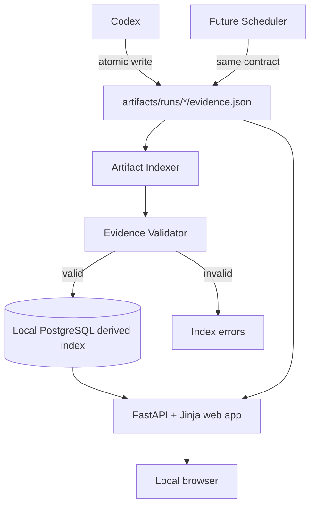

# 주식 분석 이력 웹 제품 계획

상태: MVP 범위 확정
대상 사용자: 프로젝트 소유자 1명
실행 환경: 로컬 웹 애플리케이션
작성일: 2026-08-15

## 1. 제품 한 문장

Codex가 생성한 주식 분석을 종목과 시간순으로 탐색하고, 근거·시나리오·관점의 변화를 확인하는 로컬 전용 분석 이력 브라우저다.

## 2. 확정된 결정

- 웹 앱은 `127.0.0.1`에만 바인딩한다.
- 초기 사용자는 한 명이며 인증 기능을 만들지 않는다.
- MVP는 읽기 전용이다. 투자 저널과 매매 기록은 포함하지 않는다.
- 웹 앱에서 분석을 실행하지 않는다.
- Codex 또는 향후 자동 분석 스케줄러가 생성한 artifact만 조회한다.
- `artifacts/runs/<run-id>/evidence.json`이 단일 진실 원천이다.
- 로컬 PostgreSQL은 검색 속도를 위한 파생 인덱스이며 원본이 아니다.
- 기존 standalone HTML 보고서는 상세 화면에서 열 수 있지만, 웹 화면의 데이터는 evidence에서 직접 렌더링한다.

## 3. MVP가 답해야 하는 질문

사용자는 웹 앱에서 다음 질문에 빠르게 답할 수 있어야 한다.

1. 최근 어떤 종목을 분석했는가?
2. 특정 종목을 언제, 어떤 관점과 기간으로 분석했는가?
3. 당시 상승·기준·하락 시나리오는 무엇이었는가?
4. 결론을 뒷받침한 기술·펀더멘털·뉴스 근거는 무엇인가?
5. 분석에 충돌하거나 확인되지 않은 내용은 무엇인가?
6. 같은 종목에 대한 생각이 이전 분석과 어떻게 달라졌는가?

## 4. 사용자 흐름



기본 흐름은 `홈 → 종목 선택 → 타임라인 → 분석 상세`다. 최근 분석을 확인할 때는 홈에서 상세 화면으로 바로 이동한다.

## 5. 정보 구조와 화면

### 5.1 홈 `/`

목적: 최근 분석 상태를 한눈에 확인한다.

표시 항목:

- 전체 분석 실행 수
- 분석한 종목 수
- 마지막 분석 시각
- 유효한 artifact 수와 인덱싱 오류 수
- 최근 분석 10건
- 종목별 최신 분석 목록

최근 분석 카드:

- 티커와 거래소
- 분석 기준일
- timeframe과 horizon
- 출처 수, 주장 수
- review 상태
- 상세 화면 링크

빈 상태에서는 `artifacts/runs/`에 분석 결과가 없다는 설명과 예상 경로를 보여준다.

### 5.2 분석 이력 `/analyses`

목적: 전체 분석 실행을 검색하고 필터링한다.

필터:

- 티커 또는 run ID 검색
- 거래소
- timeframe
- horizon
- 분석 기준일 범위

정렬:

- 기본: 최신 분석순
- 선택: 오래된 분석순, 티커순

목록은 서버 측 페이지네이션을 사용한다. 첫 버전은 페이지당 20건으로 고정한다.

### 5.3 종목별 타임라인 `/stocks/{exchange}/{ticker}`

목적: 같은 종목의 분석 관점이 시간에 따라 어떻게 변했는지 확인한다.

표시 항목:

- 분석 횟수와 최초·최근 분석일
- 시간순 분석 카드
- 각 실행의 timeframe, horizon, claim/source 수
- bull/base/bear 논지 요약
- 직전 분석과 비교 링크

MVP의 비교 기능은 두 실행을 나란히 배치하는 수준으로 제한한다. 의미 기반 자동 diff는 후속 기능이다.

### 5.4 분석 상세 `/analyses/{run_id}`

목적: 한 번의 분석을 evidence 단위로 검토한다.

섹션:

1. 실행 메타데이터
2. 기술·펀더멘털·뉴스 lane 상태
3. bull/base/bear 시나리오와 trigger/invalidation
4. 원자 주장, 종류, 신뢰도, 출처
5. 충돌하는 증거
6. 분석의 한계
7. 출처 목록
8. standalone HTML과 원본 JSON 링크

주장과 출처 ID는 서로 이동할 수 있는 앵커 링크로 연결한다.

### 5.5 비교 `/compare?left=<run-id>&right=<run-id>`

목적: 같은 종목의 두 분석을 직접 비교한다.

MVP 표시 항목:

- 실행 메타데이터 좌우 비교
- 각 시나리오 논지와 조건 좌우 비교
- lane별 주장 목록 좌우 비교
- 출처·충돌·한계 개수 비교

서로 다른 종목을 선택하면 비교를 거부하고 동일 종목 분석을 선택하도록 안내한다.

### 5.6 시스템 상태 `/system`

목적: 읽을 수 없는 artifact와 마지막 인덱싱 결과를 확인한다.

표시 항목:

- 마지막 동기화 시각
- 스캔한 폴더 수
- 추가·갱신·삭제된 인덱스 수
- 검증 실패 또는 JSON 파싱 오류
- 오류가 발생한 artifact 상대 경로

## 6. 화면 방향

제품의 시각적 방향은 화려한 트레이딩 터미널보다 **차분한 리서치 아카이브**에 가깝게 한다.

- 밝은 종이색 배경과 높은 텍스트 대비
- 종목·날짜·시나리오 중심의 명확한 정보 계층
- bull/base/bear 색상은 보조 신호로만 사용
- 핵심 정보는 색상을 보지 않아도 이해 가능해야 함
- 모바일에서도 분석 목록과 상세 내용을 읽을 수 있는 반응형 레이아웃
- 과도한 실시간 시세 표현, 깜빡임, 매수·매도 유도 문구는 사용하지 않음

## 7. 시스템 아키텍처



### 기술 선택

- Python 3.12+
- FastAPI: 로컬 웹 서버와 라우팅
- Jinja2: 서버 렌더링
- PostgreSQL: 로컬 파생 인덱스
- SQLAlchemy 2.x + Psycopg 3: 동기식 데이터 접근
- Alembic: 명시적인 schema migration
- 최소한의 vanilla JavaScript: 비교 선택 등 꼭 필요한 상호작용
- CSS: 프로젝트 전용 반응형 스타일
- `unittest`: 단위·라우트·인덱싱 테스트

초기에는 React, 별도 API 서버, Redis, Docker, 사용자 인증을 도입하지 않는다. PostgreSQL은 사용자의 로컬 프로세스를 사용하며 컨테이너 실행을 전제로 하지 않는다.

## 8. 데이터 소유권

### 원본

```text
artifacts/runs/<run-id>/evidence.json
artifacts/runs/<run-id>/<ticker>-<yyyy-mm-dd>.html
```

원본 artifact는 웹 앱이 수정하거나 삭제하지 않는다.

### 파생 인덱스

```text
PostgreSQL database: my_stock
Connection setting: MY_STOCK_DATABASE_URL
```

데이터베이스 schema와 데이터는 artifact에서 다시 만들 수 있어야 한다. 자동으로 database나 schema를 삭제하지 않으며, 초기화는 별도의 명시적 관리 명령으로만 수행한다. 접속 문자열과 자격 증명은 Git에 포함하지 않는다.

권장 로컬 설정은 비밀번호를 코드에 넣지 않고 운영체제 사용자 또는 로컬 PostgreSQL role을 사용하는 것이다.

```bash
createdb my_stock
export MY_STOCK_DATABASE_URL='postgresql+psycopg://localhost/my_stock'
alembic upgrade head
```

## 9. PostgreSQL 모델

### `analysis_runs`

| 필드 | 설명 |
|---|---|
| `run_id` | evidence의 고유 실행 ID, PK |
| `ticker` | 종목 티커 |
| `exchange` | 거래소 |
| `currency` | 통화 |
| `timeframe` | 분석 봉 주기 |
| `horizon` | 분석 전망 기간 |
| `as_of` | 분석 기준시각 |
| `review_verdict` | 반대 검토 결과 |
| `source_count` | 출처 수 |
| `claim_count` | 주장 수 |
| `artifact_path` | artifact root 기준 상대 경로 |
| `report_path` | artifact root 기준 standalone HTML 상대 경로 |
| `content_hash` | 증분 동기화용 SHA-256 |
| `indexed_at` | 인덱싱 시각 |
| `evidence_json` | 검증된 evidence의 파생 JSONB snapshot |

`as_of`와 `indexed_at`은 `TIMESTAMPTZ`, `evidence_json`은 `JSONB`를 사용한다. 인덱스는 `(ticker, exchange, as_of DESC)`, `(as_of DESC)`, `content_hash`에 생성한다.

### `claims`

복합 PK는 `(run_id, claim_id)`다. `lane`, `kind`, `text`, `confidence`를 저장한다.

### `sources`

복합 PK는 `(run_id, source_id)`다. 제목, URL, 발행·조회 시각, source type을 저장한다.

### `claim_sources`

주장과 출처의 다대다 관계를 저장한다.

### `scenarios`

복합 PK는 `(run_id, scenario_name)`다. `bull`, `base`, `bear`의 thesis와 invalidation을 저장한다.

### `scenario_triggers`

시나리오별 trigger 순서를 보존한다.

### `analysis_conflicts`, `analysis_limitations`

원본 배열의 표시 순서를 보존한다.

### `index_errors`

파싱·검증에 실패한 상대 경로, 오류 코드, 메시지, 파일 수정시각을 저장한다.

## 10. 인덱싱 규칙

1. 웹 앱 시작 시 `artifacts/runs/*/evidence.json`을 스캔한다.
2. 파일 SHA-256이 기존 `content_hash`와 같으면 건너뛴다.
3. 새로운 파일이나 변경 파일은 프로젝트 validator로 검증한다.
4. 유효한 artifact만 하나의 트랜잭션으로 upsert한다.
5. 실패한 artifact는 분석 목록에 넣지 않고 `index_errors`에 기록한다.
6. 사라진 artifact의 파생 레코드는 다음 동기화에서 삭제한다.
7. 동기화 실패가 기존 정상 레코드를 손상시키지 않아야 한다.
8. 백그라운드 동기화는 60초 간격으로 실행하되, 동일 파일을 중복 처리하지 않는다.
9. 동기화 프로세스는 PostgreSQL advisory lock을 사용해 같은 프로젝트의 중복 인덱싱을 막는다.

향후 스케줄러는 임시 파일에 완성된 JSON을 기록한 뒤 `evidence.json`으로 원자적 rename해야 한다. 웹 인덱서는 작성 중인 파일을 읽지 않는다.

## 11. HTTP 라우트

| Method | 경로 | 역할 |
|---|---|---|
| GET | `/` | 홈 대시보드 |
| GET | `/analyses` | 분석 검색·필터·페이지네이션 |
| GET | `/analyses/{run_id}` | 분석 상세 |
| GET | `/stocks/{exchange}/{ticker}` | 종목별 타임라인 |
| GET | `/compare` | 두 분석 비교 |
| GET | `/reports/{run_id}` | 허용된 run의 standalone HTML |
| GET | `/artifacts/{run_id}/evidence` | 브라우저용 원본 JSON |
| GET | `/system` | 인덱싱 상태와 오류 |
| GET | `/health` | 로컬 health check |

모든 파일 라우트는 데이터베이스에 등록된 상대 경로만 사용한다. URL 입력을 파일 경로로 직접 변환하지 않아 path traversal을 방지한다.

## 12. 프로젝트 구조

```text
src/my_stock_web/
├── app.py                 FastAPI 애플리케이션 팩토리
├── config.py              프로젝트·artifact·PostgreSQL 설정
├── db.py                  SQLAlchemy engine과 session
├── models.py              PostgreSQL ORM 모델
├── indexer.py             artifact 스캔·검증·upsert
├── repository.py          읽기 전용 조회 쿼리
├── view_models.py         화면 전용 데이터 변환
├── routes/
│   ├── dashboard.py
│   ├── analyses.py
│   ├── stocks.py
│   └── system.py
├── templates/
└── static/
migrations/                Alembic migration
tests/web/
```

## 13. 오류와 빈 상태

- artifact가 없음: 분석 실행 방법과 예상 폴더를 안내한다.
- JSON 파싱 실패: 시스템 화면에 경로와 안전한 오류 메시지를 표시한다.
- validator 실패: 실패 규칙을 표시하되 원본의 민감한 전체 내용을 로그에 복사하지 않는다.
- standalone HTML 없음: evidence 상세는 정상 표시하고 보고서 링크만 비활성화한다.
- 존재하지 않는 run ID: 404 화면을 반환한다.
- 잘못된 필터: 400 대신 필터를 초기화하고 안내 문구를 보여준다.
- PostgreSQL 연결 실패: 서버 시작을 중단하고 database 이름과 접속 설정 확인 방법을 보여준다.
- schema version 불일치: Alembic migration 명령을 안내하고 자동으로 schema를 변경하지 않는다.

## 14. 보안 경계

- 기본 호스트는 반드시 `127.0.0.1`이다.
- 사용자 입력과 evidence 텍스트를 HTML escape한다.
- artifact 루트 밖의 파일을 제공하지 않는다.
- 외부 URL은 `http`와 `https`만 허용하고 새 탭으로 연다.
- 쿠키, 로그인 정보, API key를 저장하지 않는다.
- `MY_STOCK_DATABASE_URL`은 환경변수로만 받고 로그에 전체 값을 출력하지 않는다.
- PostgreSQL role에는 `my_stock` database에 필요한 최소 권한만 부여한다.
- 웹 앱은 네트워크 데이터 수집과 주문 실행 기능을 갖지 않는다.

## 15. 구현 마일스톤

### M1. 프로젝트 기반과 인덱서

상태: 구현 완료

- Python 패키지와 실행 명령
- 로컬 PostgreSQL 연결 설정
- SQLAlchemy 모델과 Alembic migration
- artifact scanner와 validator 연결
- 증분 동기화와 오류 기록
- 인덱서 단위 테스트와 PostgreSQL 통합 테스트

완료 조건: 현재 SK하이닉스 run이 DB에 한 번만 인덱싱되고 재실행 시 변경이 없어야 한다.

### M2. 홈과 분석 이력

상태: 구현 완료

- 홈 요약 지표
- 최근 분석 목록
- 검색·필터·페이지네이션
- 빈 상태와 기본 오류 화면
- 로컬 standalone HTML 보고서 안전한 열기
- 데스크톱·모바일 반응형 분석 장부 UI

완료 조건: 티커와 날짜로 현재 artifact를 찾을 수 있어야 한다.

### M3. 상세와 종목 타임라인

상태: 구현 완료

- evidence 상세 렌더링
- 주장↔출처 연결
- 종목별 시간순 분석
- standalone HTML과 원본 JSON의 안전한 제공

완료 조건: SK하이닉스 상세에서 3개 시나리오, 18개 주장, 12개 출처가 표시돼야 한다.

### M4. 비교와 운영 완성도

상태: 구현 완료

- 동일 종목 두 실행 비교
- 시스템 상태 화면
- 60초 증분 동기화
- 반응형·접근성·키보드 이동 점검
- 전체 회귀 테스트와 실행 문서

완료 조건: 새 artifact가 원자적으로 추가되면 서버 재시작 없이 이력에 나타나야 한다.

## 16. MVP 완료 기준

- 로컬 명령 하나로 서버가 `127.0.0.1`에서 실행된다.
- 로컬 PostgreSQL 연결과 Alembic migration 상태를 시작 시 검증한다.
- 프로젝트에 존재하는 모든 유효한 evidence가 중복 없이 표시된다.
- 잘못된 evidence는 사용자 이력에서 제외되고 시스템 화면에 이유가 표시된다.
- 종목·거래소·날짜·timeframe·horizon으로 이력을 좁힐 수 있다.
- 분석 상세에서 모든 시나리오, 주장, 출처, 충돌, 한계를 확인할 수 있다.
- 동일 종목의 두 분석을 좌우 비교할 수 있다.
- 웹 앱이 원본 artifact를 수정하지 않는다.
- 외부 네트워크 없이 주요 기능이 동작한다.
- PostgreSQL 통합 테스트는 별도의 `my_stock_test` database에서 실행되며 SQLite 대체 구현을 사용하지 않는다.
- 향후 스케줄러가 동일한 artifact 계약으로 결과를 추가할 수 있다.

## 17. MVP 이후

1. 자동 분석 스케줄러와 실행 상태
2. 관심 종목과 분석 주기 설정
3. 시나리오 조건의 사후 결과 평가
4. 읽기·쓰기 가능한 투자 판단 저널
5. 가격 변화와 분석 시점의 비교 차트
6. 외부 접속이 필요해질 때 인증과 배포 구조 검토
